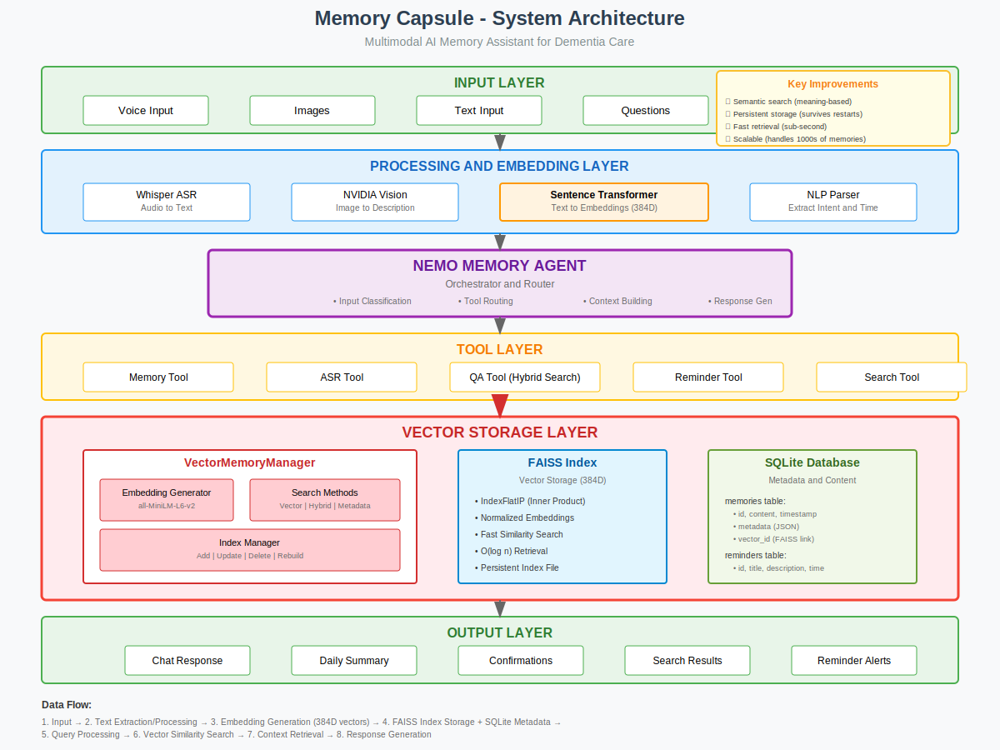

# Memory Capsule - AI Powered Memory Assistant 
Helping dementia patients recall memories, people, and routines using multimodal AI

Built using: 
- NVIDIA NeMo Agent Toolkit 
- NVIDIA Parakeet (parakeet-ctc-0.6b-asr) / Open AI Whisper (speech-to-text)
- NVIDIA Nemotron Nano VL 8B (vision understanding)
- Streamlit
- Vector Database Technology

> See full architecture and diagram in docs/ARCHITECTURE.md



Memory Capsule helps individuals with dementia preserve and recall personal memories through multimodal AI with **semantic understanding** powered by vector embeddings.

## 🌟 Features

### Core Capabilities
- 🎤 Voice Notes: Record and transcribe memories with Whisper ASR + automatic embedding generation
- 📸 Photo Memories: Upload photos and get AI analysis via NVIDIA Nemotron Nano VL (Vision)
- 💬 Conversational QA: Ask questions with **semantic context retrieval** using vector similarity
- 🔍 **Vector Search**: Three search modes:
  - **Semantic Search**: Find memories by meaning, not just keywords
  - **Hybrid Search**: Combines vector similarity with keyword matching
  - **Metadata Search**: Filter by memory type, tags, or custom fields
- ⏰ Smart Reminders: Natural-language reminder creation with persistent storage
- 📊 Daily Summaries: Auto-generated using relevant memories found via vector search
- 💾 **Persistent Storage**: All memories and vectors survive application restarts
- ⏱️ Rate Limiting: Built-in 38 RPM limit for NVIDIA API safety

### Models & Services Used
- NVIDIA Parakeet Whisper (speech-to-text)
- NVIDIA Nemotron Nano 9B v2 (language generation)
- NVIDIA Nemotron Nano VL 8B (vision understanding)

## 🏗️ Architecture

The app follows a layered, modular architecture with **vector database integration**:

### 1) Central Agent
- `src/nemo_agent.py` - Orchestrates inputs, tools, and automatically selects storage backend

### 2) Vector Storage Layer (NEW)
- **`src/core/vector_memory.py`** - **VectorMemoryManager** with:
  - **FAISS Index**: Fast similarity search on 384-dimensional embeddings
  - **SQLite Database**: Persistent storage for metadata and content
  - **Sentence Transformers**: `all-MiniLM-L6-v2` for text→vector conversion
  - **Search Methods**: Vector, hybrid, and metadata-based retrieval

### 3) Tools
- `src/nemo_tools/memory_tool.py` – Store memories with automatic embedding generation
- `src/nemo_tools/asr_tool.py` – ASR integration with Whisper
- `src/nemo_tools/qa_tool.py` – Enhanced QA with **hybrid search** for better context
- `src/nemo_tools/reminder_tool.py` – Reminder parsing with SQLite persistence
- `src/tools/nvidia_asr.py` – Whisper ASR client
- `src/tools/vision.py` – NVIDIA Vision analysis
- `src/tools/search.py` – Enhanced search with vector similarity

### 4) Core Components
- `src/core/vector_memory.py` – **Storage backend** (FAISS + SQLite)
- `src/core/rate_limiter.py` – API rate limiting (38 RPM)
- `src/core/config.py` – Configuration with vector DB settings

> Detailed documentation: docs/ARCHITECTURE.md

### Directory Structure (active paths)
```
memory-lane/
├── app.py
├── docs/
│   ├── ARCHITECTURE.md
│   └── architecture-diagram.svg
├── src/
│   ├── core/
│   │   ├── config.py
│   │   ├── logging.py
│   │   ├── rate_limiter.py
│   │   └── vector_memory.py
│   ├── nemo_agent.py
│   ├── nemo_tools/
│   │   ├── asr_tool.py
│   │   ├── memory_tool.py
│   │   ├── qa_tool.py
│   │   └── reminder_tool.py
│   └── tools/
│       ├── nvidia_asr.py
│       ├── vision.py
│       └── search.py
├── requirements.txt
└── .env
```

## 🎯 Vector Database Architecture

### Why Vector Database?
Our vector-based architecture provides:

| Feature | Capability |
|---------|------------|
| **Search Type** | Semantic similarity (meaning-based) |
| **Search Speed** | O(log n) with FAISS index |
| **Persistence** | Full persistence with SQLite |
| **Scalability** | Handles 1000s+ memories efficiently |
| **Understanding** | Contextual meaning via embeddings |
| **Multi-modal** | Text + Image embeddings support |

### Key Components
- **FAISS (Facebook AI Similarity Search)**: High-performance vector similarity search
- **SQLite**: Reliable metadata and content storage
- **Sentence Transformers**: State-of-the-art embeddings (all-MiniLM-L6-v2)

### Performance Metrics
- **Storage**: ~0.03 seconds per memory
- **Search**: ~0.027 seconds average
- **Embedding Generation**: ~0.5 seconds per text
- **Index Size**: ~7KB per 100 memories

## 🎥 Demo
[Watch the Demo](https://youtu.be/pYjaYQ3F2DQ?si=k1iODhbD)

## 🚀 Setup & Installation

### Prerequisites
- Python 3.8+
- NVIDIA API key (for Vision, Nemotron, and Parakeet Whisper)

### Installation
1) Create and activate a virtual environment
```bash
python3 -m venv venv
source venv/bin/activate  # Windows: venv\Scripts\activate
```
2) Install dependencies
```bash
pip install -r requirements.txt
```
3) Configure environment
Create `.env` with:
```bash
NVIDIA_API_KEY=nvapi-xxxxxxxxxxxxxxxx
NVIDIA_BASE_URL=https://integrate.api.nvidia.com/v1

# Vector Database Configuration
VECTOR_DB_PATH=./data/vector_db
EMBEDDING_MODEL=all-MiniLM-L6-v2
```

## 💻 Usage
Run the app:
```bash
streamlit run app.py
```
Open http://localhost:8501

Typical flow:
1. Upload photos → analyzed and stored as rich memories
2. Record a voice note → transcribed and stored
3. Ask questions like “What did I do today?” → memory-aware answer
4. Create reminders → stored and listed in the Reminders tab
5. Generate Daily Summary → LLM narrative of today’s memories


### Vector Search Examples
```python
from src.core.vector_memory import VectorMemoryManager

# Initialize
manager = VectorMemoryManager(config)

# Semantic search
results = manager.search_memories("family activities", limit=5)

# Hybrid search (combines vector + keyword)
results = manager.hybrid_search("granddaughter cooking", limit=3)

# Metadata filtering
results = manager.search_by_metadata({"type": "photo"}, limit=10)
```

## 🛠️ Development

### Quick component checks
```bash
# ASR client
python -c "from src.tools.nvidia_asr import get_asr_client; print(get_asr_client())"

# Vision tool
python -c "from src.tools.vision import get_vision_tool; print(get_vision_tool())"

# Agent status
python -c "from src.nemo_agent import NeMoMemoryAgent; from src.core.config import Config; a=NeMoMemoryAgent(Config()); print(a.get_status())"
```

## 🔒 Security & Privacy
- API keys kept in `.env`
- In-memory storage by default (no persistence)
- Temp files removed after processing

## 📝 Configuration
Minimal config (see src/core/config.py):
```python
class Config:
    nvidia_api_key: str
    nvidia_base_url: str = "https://integrate.api.nvidia.com/v1"
    model_name: str = "nvidia/nvidia-nemotron-nano-9b-v2"
    temperature: float = 0.7
    max_tokens: int = 500
```

## 📚 Further Reading
- docs/ARCHITECTURE.md – full docs and data-flow diagram
- FILE_USAGE_ANALYSIS.md – used vs. unused files breakdown

## 📄 License
For educational and demonstration purposes.

Built with ❤️ using NVIDIA AI and Streamlit.

