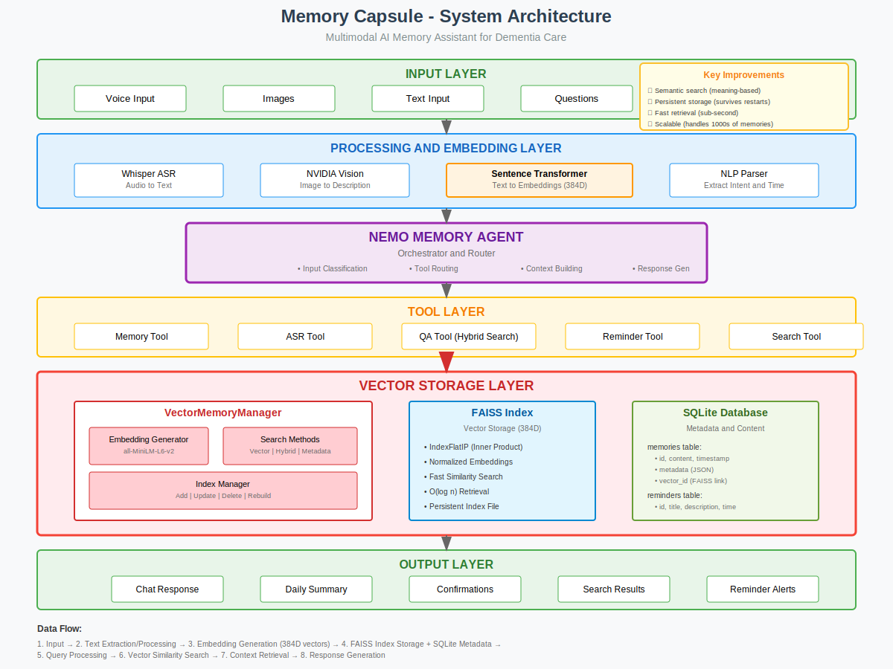

<<<<<<< HEAD
# Memory Capsule - AI-Powered Memory Assistant with Vector Database

**Enhanced with FAISS + SQLite for Semantic Memory Storage and Retrieval**

Built with the NVIDIA NeMo Agent Toolkit pattern, Streamlit, and Vector Database Technology

> See full architecture and diagram in docs/ARCHITECTURE.md



Memory Capsule helps individuals with dementia preserve and recall personal memories through multimodal AI with **semantic understanding** powered by vector embeddings.

## 🌟 Features

### Core Capabilities
- 🎤 Voice Notes: Record and transcribe memories with Whisper ASR + automatic embedding generation
- 📸 Photo Memories: Upload photos and get AI analysis via NVIDIA Nemotron Nano VL (Vision)
- 💬 Conversational QA: Ask questions with **semantic context retrieval** using vector similarity
- 🔍 **Vector Search**: Three search modes:
  - **Semantic Search**: Find memories by meaning, not just keywords
  - **Hybrid Search**: Combines vector similarity with keyword matching
  - **Metadata Search**: Filter by memory type, tags, or custom fields
- ⏰ Smart Reminders: Natural-language reminder creation with persistent storage
- 📊 Daily Summaries: Auto-generated using relevant memories found via vector search
- 💾 **Persistent Storage**: All memories and vectors survive application restarts
- ⏱️ Rate Limiting: Built-in 38 RPM limit for NVIDIA API safety

### Models & Services Used
- NVIDIA Parakeet Whisper (speech-to-text)
- NVIDIA Nemotron Nano 9B v2 (language generation)
- NVIDIA Nemotron Nano VL 8B (vision understanding)

## 🏗️ Architecture

The app follows a layered, modular architecture with **vector database integration**:

### 1) Central Agent
- `src/nemo_agent.py` - Orchestrates inputs, tools, and automatically selects storage backend

### 2) Vector Storage Layer (NEW)
- **`src/core/vector_memory.py`** - **VectorMemoryManager** with:
  - **FAISS Index**: Fast similarity search on 384-dimensional embeddings
  - **SQLite Database**: Persistent storage for metadata and content
  - **Sentence Transformers**: `all-MiniLM-L6-v2` for text→vector conversion
  - **Search Methods**: Vector, hybrid, and metadata-based retrieval

### 3) Tools
- `src/nemo_tools/memory_tool.py` – Store memories with automatic embedding generation
- `src/nemo_tools/asr_tool.py` – ASR integration with Whisper
- `src/nemo_tools/qa_tool.py` – Enhanced QA with **hybrid search** for better context
- `src/nemo_tools/reminder_tool.py` – Reminder parsing with SQLite persistence
- `src/tools/nvidia_asr.py` – Whisper ASR client
- `src/tools/vision.py` – NVIDIA Vision analysis
- `src/tools/search.py` – Enhanced search with vector similarity

### 4) Core Components
- `src/core/vector_memory.py` – **Storage backend** (FAISS + SQLite)
- `src/core/rate_limiter.py` – API rate limiting (38 RPM)
- `src/core/config.py` – Configuration with vector DB settings

> Detailed documentation: docs/ARCHITECTURE.md

### Directory Structure (active paths)
```
memory-lane/
├── app.py
├── docs/
│   ├── ARCHITECTURE.md
│   └── architecture-diagram.svg
├── src/
│   ├── core/
│   │   ├── config.py
│   │   ├── logging.py
│   │   ├── rate_limiter.py
│   │   └── vector_memory.py
│   ├── nemo_agent.py
│   ├── nemo_tools/
│   │   ├── asr_tool.py
│   │   ├── memory_tool.py
│   │   ├── qa_tool.py
│   │   └── reminder_tool.py
│   └── tools/
│       ├── nvidia_asr.py
│       ├── vision.py
│       └── search.py
├── requirements.txt
└── .env
```

## 🎯 Vector Database Architecture

### Why Vector Database?
Our vector-based architecture provides:

| Feature | Capability |
|---------|------------|
| **Search Type** | Semantic similarity (meaning-based) |
| **Search Speed** | O(log n) with FAISS index |
| **Persistence** | Full persistence with SQLite |
| **Scalability** | Handles 1000s+ memories efficiently |
| **Understanding** | Contextual meaning via embeddings |
| **Multi-modal** | Text + Image embeddings support |

### Key Components
- **FAISS (Facebook AI Similarity Search)**: High-performance vector similarity search
- **SQLite**: Reliable metadata and content storage
- **Sentence Transformers**: State-of-the-art embeddings (all-MiniLM-L6-v2)

### Performance Metrics
- **Storage**: ~0.03 seconds per memory
- **Search**: ~0.027 seconds average
- **Embedding Generation**: ~0.5 seconds per text
- **Index Size**: ~7KB per 100 memories

## 🚀 Setup & Installation

### Prerequisites
- Python 3.8+
- NVIDIA API key (for Vision, Nemotron, and Parakeet Whisper)

### Installation
1) Create and activate a virtual environment
```bash
python3 -m venv venv
source venv/bin/activate  # Windows: venv\Scripts\activate
```
2) Install dependencies
```bash
pip install -r requirements.txt
```
3) Configure environment
Create `.env` with:
```bash
NVIDIA_API_KEY=nvapi-xxxxxxxxxxxxxxxx
NVIDIA_BASE_URL=https://integrate.api.nvidia.com/v1

# Vector Database Configuration
VECTOR_DB_PATH=./data/vector_db
EMBEDDING_MODEL=all-MiniLM-L6-v2
```

## 💻 Usage
Run the app:
```bash
streamlit run app.py
```
Open http://localhost:8501

Typical flow:
1. Upload photos → analyzed and stored as rich memories
2. Record a voice note → transcribed and stored
3. Ask questions like “What did I do today?” → memory-aware answer
4. Create reminders → stored and listed in the Reminders tab
5. Generate Daily Summary → LLM narrative of today’s memories

## 📦 Data Migration

### Import Data to Vector Database
```bash
# Create sample data for testing
python migrate_to_vector.py --create-sample --test-search

# Import from JSON backup
python migrate_to_vector.py --from-json backup.json

# Test vector search
python test_vector_memory.py
```

### Vector Search Examples
```python
from src.core.vector_memory import VectorMemoryManager

# Initialize
manager = VectorMemoryManager(config)

# Semantic search
results = manager.search_memories("family activities", limit=5)

# Hybrid search (combines vector + keyword)
results = manager.hybrid_search("granddaughter cooking", limit=3)

# Metadata filtering
results = manager.search_by_metadata({"type": "photo"}, limit=10)
```

## 🛠️ Development

### Quick component checks
```bash
# ASR client
python -c "from src.tools.nvidia_asr import get_asr_client; print(get_asr_client())"

# Vision tool
python -c "from src.tools.vision import get_vision_tool; print(get_vision_tool())"

# Agent status
python -c "from src.nemo_agent import NeMoMemoryAgent; from src.core.config import Config; a=NeMoMemoryAgent(Config()); print(a.get_status())"
```

## 🔒 Security & Privacy
- API keys kept in `.env`
- In-memory storage by default (no persistence)
- Temp files removed after processing

## 📝 Configuration
Minimal config (see src/core/config.py):
```python
class Config:
    nvidia_api_key: str
    nvidia_base_url: str = "https://integrate.api.nvidia.com/v1"
    model_name: str = "nvidia/nvidia-nemotron-nano-9b-v2"
    temperature: float = 0.7
    max_tokens: int = 500
```

## 📚 Further Reading
- docs/ARCHITECTURE.md – full docs and data-flow diagram
- FILE_USAGE_ANALYSIS.md – used vs. unused files breakdown

## 📄 License
For educational and demonstration purposes.

---
Built with ❤️ using NVIDIA AI and Streamlit.
=======
# 🧠 Dementia Companion

> A compassionate desktop chat application designed specifically for people with dementia, featuring voice input, AI conversations, memory exploration, and music integration.


## 🎯 Purpose

This application provides a dementia-friendly chat interface with large buttons, clear fonts, and AI responses specifically designed to be patient, supportive, and easy to understand.

## Features

- **Dementia-Friendly Design**: Large buttons, high contrast colors, and clear fonts
- **Voice Input**: Browser-based speech recognition for easy communication
- **Three Modes**:
  - **Chat**: General conversation with AI assistant
  - **Memory Lane**: Guided conversations about memories and experiences
  - **Music**: Spotify integration for music discovery and playback
- **Accessibility**: Responsive design with high contrast mode support
- **AI-Powered**: Uses Gemini API for intelligent, patient responses

## Technology Stack

### Backend
- Node.js with Express
- Gemini AI API for chat responses
- CORS enabled for cross-origin requests
- Multer for file handling (voice uploads)

### Frontend
- React with TypeScript
- Browser Speech Recognition API
- Axios for API communication
- React Icons for UI elements
- Responsive CSS with accessibility features

## Setup Instructions

### Prerequisites
- Node.js (v16 or higher)
- npm or yarn
- Modern web browser with speech recognition support

### Installation

1. **Clone the repository:**
   ```bash
   git clone git@github.com:mrunmayee17/Dementia-companion.git
   cd Dementia-companion
   ```

2. **Install dependencies for all parts:**
   ```bash
   npm run install-all
   ```

3. **Configure environment variables:**
   ```bash
   # Copy the template file
   cp server/.env.template server/.env
   
   # Edit the .env file and add your API keys
   # Get Gemini API key from: https://aistudio.google.com/app/apikey
   ```
   
   Update `server/.env` with your keys:
   ```env
   PORT=5001
   GEMINI_API_KEY=your_actual_gemini_api_key_here
   SPOTIFY_CLIENT_ID=your_spotify_client_id_here  # Optional
   SPOTIFY_CLIENT_SECRET=your_spotify_client_secret_here  # Optional
   ```

4. **Start the desktop application:**
   ```bash
   ./launch-desktop.sh
   ```

   Or manually:
   ```bash
   # Start server first
   cd server && node index.js &
   
   # Then start desktop app
   cd ../client && npm run electron
   ```

   The server runs on port 5001 and the desktop app loads locally.

### Manual Setup (Alternative)

If the above doesn't work, you can start each part manually:

1. **Start the backend:**
   ```bash
   cd server
   npm install
   npm start
   ```

2. **Start the frontend (in a new terminal):**
   ```bash
   cd client
   npm install
   npm start
   ```

## Usage Guide

### For Caregivers/Setup

1. **Accessing the Application:**
   - Open a web browser and go to `http://localhost:3000`
   - Ensure microphone permissions are granted for voice input

2. **Browser Compatibility:**
   - Chrome, Edge, and Safari work best for speech recognition
   - Firefox has limited speech recognition support

### For Users with Dementia

1. **Chat Mode:**
   - Ask any questions or have a conversation
   - The AI responds with simple, clear language
   - Use voice or type messages

2. **Memory Lane:**
   - Explore memories from the past
   - The AI asks gentle, guiding questions
   - Share stories about family, childhood, or special moments

3. **Music Mode:**
   - Ask for songs by name or describe your mood
   - Get music recommendations
   - (Note: Full Spotify integration requires additional setup)

## API Endpoints

### Backend Endpoints

- `GET /api/health` - Health check
- `POST /api/chat` - General chat conversations
- `POST /api/memory-lane` - Memory-focused conversations
- `POST /api/spotify` - Music-related requests
- `POST /api/voice-to-text` - Voice processing (currently placeholder)

### Example API Usage

```javascript
// Chat request
const response = await axios.post('http://localhost:5000/api/chat', {
  message: "Hello, how are you today?"
});

// Memory Lane request
const response = await axios.post('http://localhost:5000/api/memory-lane', {
  query: "Tell me about childhood memories",
  memoryType: "childhood"
});

// Spotify request
const response = await axios.post('http://localhost:5000/api/spotify', {
  action: "search",
  query: "happy songs",
  mood: "happy"
});
```

## Customization

### Modifying AI Responses
Edit the prompts in `server/index.js` to customize how the AI responds:
- Chat responses: Line 38-44
- Memory Lane responses: Line 91-96
- Error messages throughout the file

### Styling Changes
Modify `client/src/App.css` to adjust:
- Colors and contrast
- Button sizes
- Font sizes
- Spacing and layout

### Adding New Features
1. Add new endpoints in `server/index.js`
2. Create new UI components in `client/src/`
3. Update the sidebar with new buttons

## Accessibility Features

- **Large Buttons**: Easy to press for users with motor difficulties
- **High Contrast**: Better visibility for users with vision issues
- **Simple Language**: AI trained to use clear, simple responses
- **Voice Input**: Alternative to typing for users with dexterity issues
- **Responsive Design**: Works on tablets and mobile devices
- **Error Handling**: Gentle error messages that don't cause confusion

## Development Notes

### Voice Recognition
- Uses browser's built-in Speech Recognition API
- Falls back gracefully if not supported
- Provides clear error messages for common issues

### AI Integration
- Gemini API configured with dementia-specific prompts
- Responses are kept short and simple
- Error handling prevents overwhelming users

### Security
- API keys stored in environment variables
- CORS configured for local development
- Input validation on all endpoints

## Troubleshooting

### Common Issues

1. **Voice not working:**
   - Check microphone permissions in browser
   - Ensure using Chrome, Edge, or Safari
   - Check if microphone is working in other applications

2. **API errors:**
   - Verify Gemini API key is correct
   - Check server is running on port 5000
   - Look at browser console for error messages

3. **Styling issues:**
   - Clear browser cache
   - Check if CSS file is loading properly
   - Verify React development server is running

### Getting Help

Check the browser console (F12) for error messages. Most issues will be logged there with helpful information.

## Future Enhancements

- Full Spotify Web API integration
- Photo memory sharing
- Voice recognition improvements with Gemini Audio API
- Caregiver dashboard for monitoring usage
- Offline mode for basic functionality
- Multiple language support

## License

MIT License - feel free to modify and use for your needs.
>>>>>>> 6c2d260b1f6e515781a4952af140efc83b189e06
